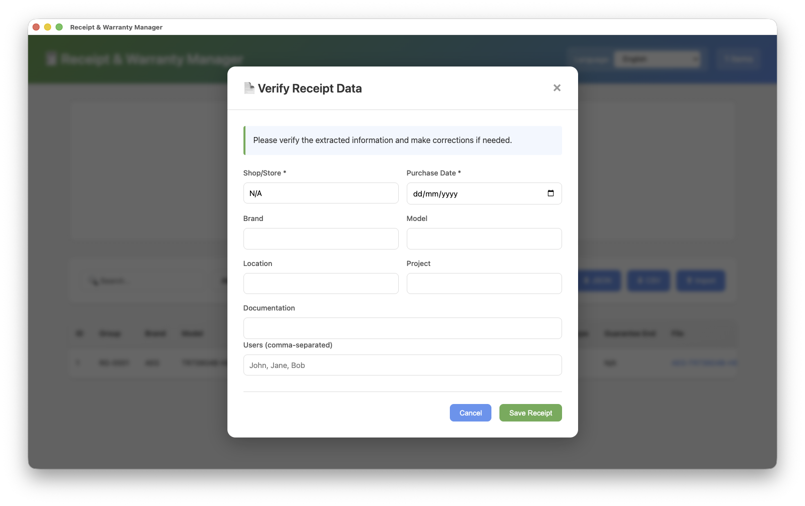

# Receipt & Warranty Manager

<<<<<<< HEAD
## Screenshots


*Receipt Manager main interface with item list and search filters*


*Adding a new receipt with item details*

A local web-based application for managing receipts and item warranties with automatic file organization, integrity checking, and a modern green-themed UI.
=======
A local application for managing receipts and item warranties with automatic file organization, integrity checking, OCR receipt scanning, and a modern green-themed UI.

Available as a **native macOS app** (Apple Silicon) or as a **self-hosted web app** (macOS, Linux, Windows).

---

## ⬇️ Download (macOS Apple Silicon)

**No setup required — drag, drop, and run.**

👉 [Download the latest DMG from Releases](https://github.com/SaVaGi-eu/receipts-manager/releases/latest)

- Requires **macOS 12+ on Apple Silicon (M1/M2/M3/M4)**
- Python, Flask, and all dependencies are bundled — nothing to install
- PDF OCR support included (poppler bundled)

> ⚠️ **Important — First Launch**  
> Because this app is not signed with an Apple Developer certificate, macOS may show a **"damaged and can't be opened"** warning. This is a false alarm — the app is safe. See the [First Launch fix](#-app-shows-damaged-and-cant-be-opened) in Troubleshooting below.

---
>>>>>>> MacOS-app

## Features

### Core Functionality
- **Drag & Drop Receipt Upload** — Upload PDF, JPG, or PNG files up to 50MB
- **OCR Scanning** — Automatic text extraction from receipts using EasyOCR
- **Multi-Item Support** — Handle single or multiple items per receipt
- **Smart File Organization** — Automatic file naming and directory structure
- **Guarantee Tracking** — Track warranty periods with expiration alerts
- **Search & Filter** — Find items by brand, model, project, user, or status
- **Data Export** — Export to JSON or CSV formats
- **Data Import** — Import previously exported JSON data
- **File Integrity Checking** — Automatic verification every 30 seconds + manual re-check
- **Auto-Backup** — Rolling backups (keeps last 20) on every save

### UI Features
- **System Theme Detection** — Automatic dark/light mode based on OS settings
- **Fresh Green Color Scheme** — Calming, nature-inspired design
- **Alternating Row Colors** — Enhanced readability
- **Sortable Columns** — Click headers to sort by any column
- **Column Visibility Toggles** — Show/hide columns as needed
- **Project Color Coding** — Visual differentiation of projects
- **Status Highlights** — Yellow for expiring soon (90 days), red for expired
- **Responsive Design** — Works on desktop and tablet

---

## Installation

### Option A — macOS Native App (Recommended for Apple Silicon)

1. [Download the DMG](https://github.com/SaVaGi-eu/receipts-manager/releases/latest)
2. Open the DMG and drag **Receipt Manager** to your Applications folder
3. **Before opening**: run the quarantine fix (see below) — macOS will otherwise block the app
4. Open Terminal (`Cmd + Space` → type `Terminal` → Enter) and run:
   ```bash
   xattr -cr /Applications/Receipt\ Manager.app
   ```
5. Double-click the app — it will open normally from now on

### Option B — Web App (macOS, Linux, Windows)

#### Prerequisites
- **Python 3.8 or higher**
  - Mac: `brew install python` or download from [python.org](https://www.python.org/downloads/)
  - Linux: `sudo apt install python3 python3-venv python3-pip`
  - Windows: Download from [python.org](https://www.python.org/downloads/)
- **poppler** (required for PDF OCR support)
  - Mac: `brew install poppler`
  - Linux: `sudo apt install poppler-utils`
  - Windows: Download from [poppler releases](https://github.com/oschwartz10612/poppler-windows/releases)

#### Quick Start

**Mac / Linux:**
```bash
git clone https://github.com/SaVaGi-eu/receipts-manager.git
cd receipts-manager
./run.sh
```
Then open your browser to `http://127.0.0.1:5000`

**Windows:**
```cmd
git clone https://github.com/SaVaGi-eu/receipts-manager.git
cd receipts-manager
python -m venv venv
venv\Scripts\activate
pip install -r requirements.txt
python app.py
```
Then open your browser to `http://127.0.0.1:5000`

> **First launch** may take 1-2 minutes to install dependencies.

---

## Build the macOS App from Source

If you want to build the DMG yourself (Apple Silicon required):

### Prerequisites
- [Node.js](https://nodejs.org) (v18+)
- [Homebrew](https://brew.sh)
- Python 3.8+

### Steps

```bash
# 1. Clone and enter the MacOS-app branch
git clone https://github.com/SaVaGi-eu/receipts-manager.git
cd receipts-manager
git checkout MacOS-app

# 2. Set up Python environment
python3 -m venv venv
source venv/bin/activate
pip install -r requirements.txt

# 3. Install Node dependencies
npm install

# 4. Bundle poppler (one-time setup, ~2 minutes)
./setup-vendor.sh

# 5. Test the app
npm start

# 6. Build the DMG
npm run build
# Output: dist/Receipt Manager-1.0.0-arm64.dmg
```

---

## Usage Guide

### Adding Items

#### Step 1: Upload Receipt
1. **Drag & drop** a receipt file onto the drop zone, or **click to browse**
2. The OCR engine automatically extracts shop name and purchase date
3. Review and complete the pre-filled fields:
   - **Shop**: Where you purchased (autocomplete suggests previous entries)
   - **Purchase Date**: Format `YYYY-MMM-DD` (e.g., `2026-Feb-15`)
   - **Documentation**: Receipt type (e.g., `Invoice`, `Warranty Card`)
4. Fill in item details: Brand, Model, Location, Users, Project, Guarantee

#### Step 2: Review & Save
The app automatically:
- Generates unique Receipt Group ID (`RG-0001`, `RG-0002`, etc.)
- Creates properly organized file structure
- Calculates guarantee end dates
- Prevents duplicate filenames

### File Organization

#### Multi-Item Receipts (quantity > 1)
- Stored in: `_Receipts/`
- Filename: `Shop-PurchaseDate-Documentation-ReceiptGroupID.ext`
- Example: `IKEA-2026Feb15-Invoice-RG-0001.pdf`

#### Single-Item Receipts (quantity = 1)
- Stored in: `ProjectName/` or `BrandName/` (if project = N/A)
- Filename: `Brand-Model-PurchaseDate-Shop-Location-Users-Documentation.ext`
- Example: `Apple/Apple-iPhone15ProMax-2026Feb15-Coolblue-Home-John-Jane-Invoice.pdf`

### Editing Items

1. Click **✏️ Edit** button on any row
2. Modify fields as needed
3. Click **Save Changes**

Single-item receipts are automatically renamed/moved if key fields change. Multi-item receipts stay in `_Receipts/`, only metadata is updated.

### Deleting Items

1. Click **🗑️ Delete** button on any row
2. Confirm deletion

For multi-item receipts: the file is deleted only when the **last** item referencing it is deleted.

### File Integrity

**Automatic Checks** run on startup and every 30 seconds. When files go missing:
- Red **🔴** indicator appears in the File column
- Row shown with strike-through text
- Red banner at top lists all missing files
- Click **🔄 Re-check Files Now** to verify again

### Search & Filters

- **Search Box**: Filters by brand, model, location, project, shop, documentation, or users
- **Project Filter**: Show items from a specific project
- **Status Filter**: Active / Expiring Soon (90 days) / Expired / No Guarantee
- **User Filter**: Show items tagged with a specific user
- **Sorting**: Click any column header to sort ascending/descending

### Data Management

| Action | Description |
|---|---|
| **Export JSON** | Full backup — can be re-imported later |
| **Export CSV** | Flat view for Excel / Google Sheets |
| **Import JSON** | Restore from backup (**replaces all current data**) |

---

## Data Storage

- `data/data.json` — Main database
- `data/backups/` — Rolling backups (last 20 saves, timestamped)
- `_Receipts/` — Multi-item receipt files
- `ProjectName/` or `BrandName/` — Single-item receipt files

### Data Format Example
```json
{
  "receipts": [
    {
      "receipt_group_id": "RG-0001",
      "shop": "Coolblue",
      "purchase_date": "2026-Feb-15",
      "documentation": "Invoice",
      "receipt_filename": "Coolblue-2026Feb15-Invoice-RG-0001.pdf",
      "receipt_relative_path": "_Receipts/Coolblue-2026Feb15-Invoice-RG-0001.pdf"
    }
  ],
  "items": [
    {
      "id": 1,
      "receipt_group_id": "RG-0001",
      "brand": "Apple",
      "model": "iPhone 15 Pro Max",
      "location": "Home",
      "users": ["John", "Jane"],
      "project": "N/A",
      "guarantee_duration": 24,
      "guarantee_unit": "months",
      "guarantee_end_date": "2028-Feb-28",
      "receipt_relative_path": "_Receipts/Coolblue-2026Feb15-Invoice-RG-0001.pdf"
    }
  ],
  "next_id": 2
}
```

---

## Technical Details

### Technology Stack
- **Backend**: Flask (Python)
- **Frontend**: Vanilla JavaScript, HTML5, CSS3
- **OCR**: EasyOCR + pdf2image + poppler
- **Desktop App**: Electron (macOS)
- **Storage**: JSON file (no database required)

### System Requirements

| | macOS App | Web App |
|---|---|---|
| **OS** | macOS 12+ Apple Silicon | macOS / Linux / Windows |
| **Python** | Bundled | 3.8+ required |
| **Browser** | Not needed | Chrome 90+, Firefox 88+, Safari 14+ |
| **RAM** | 512MB recommended | 256MB minimum |
| **Disk** | 300MB (app) + receipts | 100MB + receipts |

### Port Configuration
- Default: `http://127.0.0.1:5000`
- Local machine only (not network-accessible)
- To change port: Edit `app.py`: `app.run(host='127.0.0.1', port=5000)`

### File Upload Limits
- Maximum file size: 50MB
- Supported formats: PDF, JPG, JPEG, PNG
- To change limit: Edit `app.py`: `app.config['MAX_CONTENT_LENGTH']`

---

## Folder Structure

```
receipts-manager/
├── app.py                  # Main Flask application
├── ocr_service.py          # OCR processing service
├── requirements.txt        # Python dependencies
├── run.sh                  # Linux/Mac web launcher
├── run.command             # Mac double-click launcher
├── electron-main.js        # Electron desktop app entry point
├── package.json            # Node.js config for Electron build
├── setup-vendor.sh         # One-time poppler bundling script (macOS build)
├── README.md
├── data/
│   ├── data.json           # Main database
│   └── backups/            # Auto-backups
├── _Receipts/              # Multi-item receipts
├── [ProjectNames]/         # Single-item receipts by project
├── [BrandNames]/           # Single-item receipts by brand (if no project)
├── static/
│   ├── css/style.css       # Styling
│   └── js/app.js           # Frontend logic
├── templates/
│   └── index.html          # Main page
└── venv/                   # Virtual environment (local only, not in git)
```

---

## Troubleshooting

### 🚨 App shows "damaged and can't be opened"

This is the most common issue and affects **all users on first install**. It is **not** a real problem with the app — macOS adds a quarantine flag to every file downloaded from the internet, and applies this aggressive warning to unsigned apps.

**Fix — open Terminal and run:**
```bash
xattr -cr /Applications/Receipt\ Manager.app
```

Alternatively, drag the app icon directly into the Terminal window after typing `xattr -cr ` (with a trailing space).

You only need to do this **once**. The app will open normally from then on.

> **Why does this happen to this app but not others?**  
> Apps distributed via the Mac App Store or signed with an Apple Developer ID certificate ($99/year) are automatically trusted by macOS Gatekeeper. This app is open-source and unsigned, so macOS treats it with maximum suspicion. The `xattr -cr` command simply removes the quarantine flag macOS attached to the file.

### "Python 3 is not installed"
- **Mac**: `brew install python` or [python.org](https://www.python.org/downloads/)
- **Ubuntu/Debian**: `sudo apt install python3 python3-venv python3-pip`
- **Fedora**: `sudo dnf install python3 python3-pip`
- **Windows**: [python.org](https://www.python.org/downloads/)

### PDF OCR not working
PDF conversion requires poppler:
- **Mac**: `brew install poppler`
- **Linux**: `sudo apt install poppler-utils`
- **macOS App**: Already bundled — no action needed

### "Address already in use"
Port 5000 is taken. Either stop the other app, or change the port in `app.py`.

### "Permission denied" running scripts
```bash
chmod +x run.sh run.command setup-vendor.sh
```

### App won't start (web version)
1. Check Python version: `python3 --version` (must be 3.8+)
2. Delete `venv/` and restart (forces fresh install)
3. Check terminal for error messages
4. Ensure port 5000 is free

### Integrity errors after moving files
If you move files outside the app, the integrity checker will flag them (red 🔴). Either move the files back, or delete and re-upload the affected items.

---

## FAQ

**Q: Does the macOS app work on Intel Macs?**  
A: Not yet — the current release is Apple Silicon (M1/M2/M3/M4) only. Intel and Universal builds are planned for a future release.

**Q: Can I use this on Windows?**  
A: Yes, via the web app (Option B above). The native Electron app is macOS-only for now.

**Q: How do I move the app to another computer?**  
A: Export your data as JSON, install the app on the new machine, then import the JSON. Or copy the entire folder if both machines use the same OS.

**Q: Can multiple people use this simultaneously?**  
A: It's designed for single-user local use. For multi-user, you'd need to add authentication and host on a server.

**Q: What if I accidentally delete an item?**  
A: Check `data/backups/` for recent backups. Import the most recent one created before the deletion.

**Q: Does this work offline?**  
A: Yes — after installation, no internet connection is needed.

**Q: How many items can it handle?**  
A: Tested with 10,000+ items. Search/filter may slow with 50,000+ items.

**Q: Can I add custom fields?**  
A: Yes, but requires changes to `app.py`, `templates/index.html`, and `static/js/app.js`.

---

## Security & Privacy

- **No internet connection required** after installation
- **No data sent to external servers** — everything stays on your machine
- Runs on `127.0.0.1` (localhost only) — not accessible from the network
- No authentication (single-user, trusted machine design)

> For multi-user or networked use, additional authentication layers would be required.

---

## License

MIT License — free to use, modify, and distribute.

---

## Changelog

### v1.0.0 (February 2026)
- Initial release
- Native macOS app (Apple Silicon DMG)
- Core receipt and item management
- OCR scanning with EasyOCR
- Automatic file organization
- Integrity checking and auto-backup
- Search, filter, sort functionality
- Dark/light theme support
- Export/import (JSON + CSV)

---

**Enjoy managing your receipts and warranties! 📦✨**
