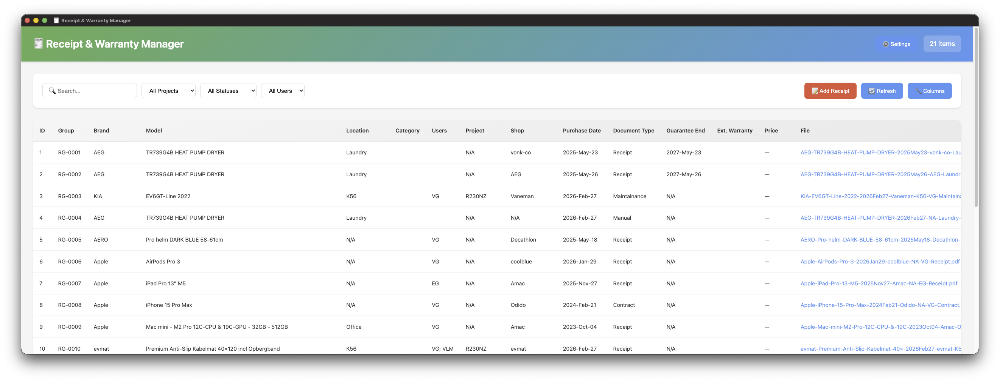
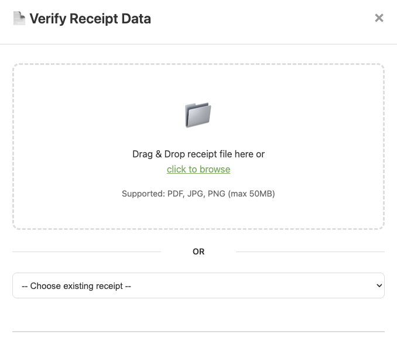
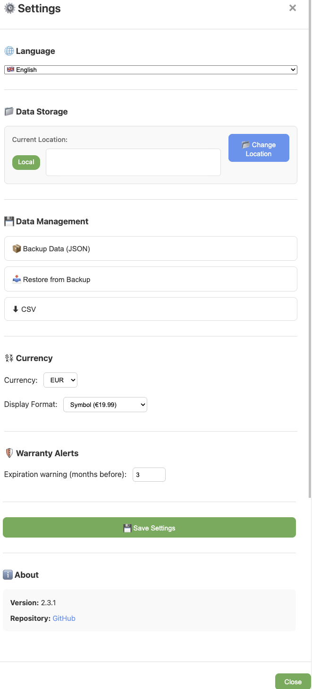
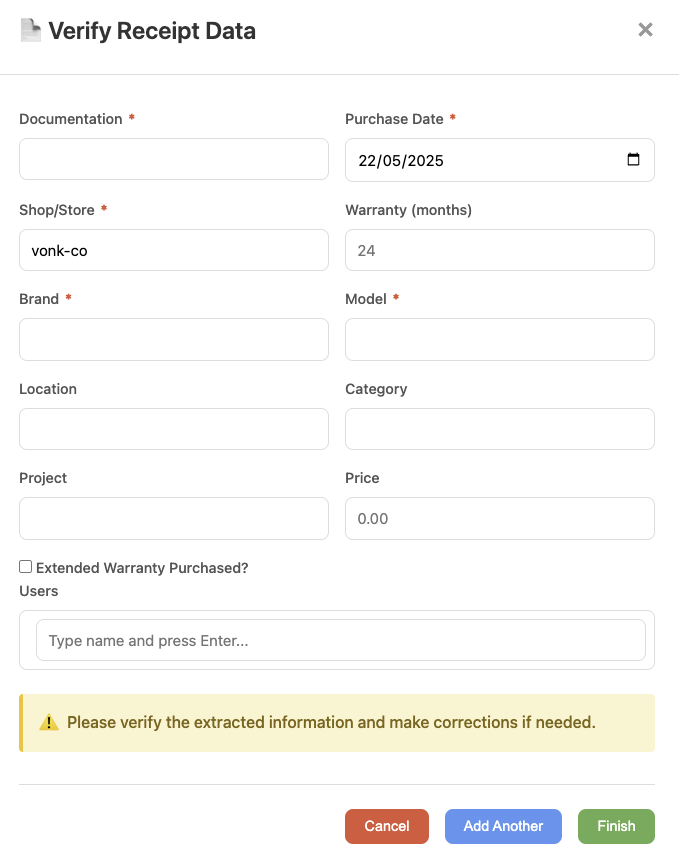

# Receipt & Warranty Manager

<p align="center">
  
</p>

<table align="center">
  <tr>
    <td align="center">
      
      <br/>
      <sub><b>Add Receipt</b></sub>
    </td>
    <td width="30"></td>
    <td align="center">
      
      <br/>
      <sub><b>Settings</b></sub>
    </td>
    <td width="30"></td>
    <td align="center">
      
      <br/>
      <sub><b>Verify Receipt</b></sub>
    </td>
  </tr>
</table>


A multilingual receipt and warranty management system with OCR support for scanning and organizing receipts, warranties, and related documents.

---

## 🚀 Quick Start

**One command to install:**

```bash
git clone https://github.com/SaVaGi-eu/receipts-manager.git
cd receipts-manager
chmod +x install.sh
./install.sh
```

The installer will detect your system and offer appropriate options:

### macOS Users

1. 📦 **Build macOS Application** - Creates a native `.app` with DMG installer
2. 🐳 **Build Docker Container** - Run in Docker
3. 💻 **Run Directly** - Development mode (web server)

### Linux Users

1. 🐳 **Build Docker Container** - Run in Docker
2. 💻 **Run Directly** - Development mode (web server)

---

## 📋 Features

<p align="center">
  
</p>

- 📸 **Receipt Scanning**: OCR-powered text extraction from receipt images
- 🗂️ **Warranty Tracking**: Organize and track product warranties with expiration alerts
- 🌍 **Multilingual**: Full support for English, Dutch, Greek, and Latvian
- 🔍 **Full-Text Search**: Search across all receipts and documents
- 📊 **Expense Tracking**: Categorize and analyze spending
- 🏷️ **Smart Tagging**: Automatic categorization and custom tags
- 💾 **Local Storage**: All data stored locally for privacy
- 🖼️ **Image Management**: Attach multiple images per receipt
- 📄 **PDF Support**: Scan and process PDF receipts
- 💾 **Backup & Restore**: Automatic backups with easy restore

---

## 🛠️ Platform-Specific Builds

### 🍎 macOS Native App

<p align="center">
  
</p>

The macOS app includes:

- ✅ Python runtime bundled
- ✅ All dependencies included
- ✅ Tesseract OCR with multilingual support
- ✅ Native window with Electron
- ✅ No terminal required
- ✅ First-time setup wizard

**Requirements:**

- macOS 10.15 (Catalina) or later
- 200 MB disk space
- Apple Silicon (M1/M2/M3) or Intel

**Building:**

```bash
./install.sh  # Choose option 1
```

### 🐳 Docker Deployment

For server deployment or consistent environments:

```bash
cd platforms/docker
docker-compose up -d
```

Access at: `http://localhost:8765`

**See [Docker Documentation](docs/DOCKER.md) for details.**

### 💻 Direct Execution

For development or quick testing:

```bash
./install.sh  # Choose option 3 (or 2 on Linux)
```

This creates a virtual environment and runs the Flask server.

---

## 📁 Project Structure

```
receipts-manager/
├── install.sh              # Universal installer (START HERE)
├── app.py                  # Main Flask application
├── config.py               # Configuration
├── ocr_service.py          # OCR processing
├── requirements.txt        # Python dependencies
├── .env.example            # Environment variables template
│
├── platforms/
│   ├── macos/              # macOS Electron app
│   └── docker/             # Docker deployment
│
├── media/
│   ├── screenshots/        # Application screenshots
│   └── branding/           # App icon and DMG background assets
│
├── templates/              # HTML templates
├── static/                 # CSS, JS, images
├── docs/                   # Documentation
├── data/                   # Database (created on first run)
└── storage/                # Receipt files (created on first run)
```

---

## 🌐 Multilingual Support

Supported OCR languages:

- 🇬🇧 **English** (eng)
- 🇳🇱 **Dutch** (nld)
- 🇬🇷 **Greek** (ell)
- 🇱🇻 **Latvian** (lav)

Additional languages can be added by installing the corresponding Tesseract language pack.

---

## 💻 System Requirements

### macOS App

- macOS 10.15+ (Catalina or later)
- 200 MB disk space
- Apple Silicon (M1/M2/M3) or Intel

### Docker

- Docker Desktop or Docker Engine
- 500 MB disk space

### Direct Execution

- Python 3.8 or higher
- Tesseract OCR 4.0+ (optional, for OCR features)
- 200 MB disk space

---

## 📚 Documentation

### User Guides

- 🚀 [Quick Start Guide](QUICKSTART.md) - Get started in 5 minutes
- 📝 [Workflows](WORKFLOWS.md) - Common usage patterns
- 🔍 [OCR Setup](OCR_SETUP.md) - Configure OCR for best results
- 🔗 [Integration Guide](INTEGRATION_GUIDE.md) - API and integrations

### Deployment

- 🐳 [Docker Guide](docs/DOCKER.md) - Docker deployment
- 🍎 [macOS Build](platforms/macos/README.md) - Building the macOS app

### Development

- 🤝 [Contributing](CONTRIBUTING.md) - How to contribute
- 🏛️ [Project Structure](STRUCTURE.md) - Codebase overview
- 🔧 [Troubleshooting](TROUBLESHOOTING.md) - Common issues
- 📜 [Changelog](CHANGELOG.md) - Version history

### Reference

- ⚙️ [Environment Variables](.env.example) - Configuration options
- 🔒 [Security Policy](SECURITY.md) - Security and reporting
- 📜 [Full Documentation](docs/README.md) - Complete docs index

---

## 🔧 Development

### Setup Development Environment

```bash
# Clone the repository
git clone https://github.com/SaVaGi-eu/receipts-manager.git
cd receipts-manager

# Create virtual environment
python3 -m venv venv
source venv/bin/activate  # Windows: venv\Scripts\activate

# Install dependencies
pip install -r requirements.txt

# Install development tools
pip install pre-commit black flake8 isort pytest

# Setup pre-commit hooks
pre-commit install

# Copy environment template
cp .env.example .env

# Run the application
python app.py
```

Access at: `http://127.0.0.1:8765`

### Running Tests

```bash
# Run all tests
pytest

# Run with coverage
pytest --cov=.
```

### Code Quality

```bash
# Format code
black .

# Sort imports
isort .

# Lint code
flake8 .

# Run all pre-commit checks
pre-commit run --all-files
```

See [CONTRIBUTING.md](CONTRIBUTING.md) for detailed development guidelines.

---

## 🔒 Security

- All data is stored **locally** - no cloud services
- No telemetry or tracking
- Open source - inspect the code yourself

See [SECURITY.md](SECURITY.md) for security policy and vulnerability reporting.

---

## 📎 Roadmap

- [ ] Mobile app (iOS/Android)
- [ ] Cloud sync (optional)
- [ ] Receipt template recognition
- [ ] Budget planning features
- [ ] Export to accounting software
- [ ] Multi-user support
- [ ] Dark mode

---

## 📝 License

MIT License - free to use, modify, and distribute.

See [LICENSE](LICENSE) for details.

---

## 🤝 Contributing

Contributions are welcome! Please read [CONTRIBUTING.md](CONTRIBUTING.md) for guidelines.

### Quick Contribution Guide

1. Fork the repository
2. Create a feature branch: `git checkout -b feature/amazing-feature`
3. Make your changes
4. Run tests and linters
5. Commit: `git commit -m 'feat: Add amazing feature'`
6. Push: `git push origin feature/amazing-feature`
7. Open a Pull Request

---

## 📮 Support

- 🐛 **Bug Reports**: [GitHub Issues](https://github.com/SaVaGi-eu/receipts-manager/issues)
- 📝 **Project Board**: [Jira Board](https://savagi.atlassian.net/jira/software/c/projects/RM/boards/42)
- 💬 **Discussions**: [GitHub Discussions](https://github.com/SaVaGi-eu/receipts-manager/discussions)

---

## 🙏 Acknowledgments

Built with these amazing open-source projects:

- [Tesseract OCR](https://github.com/tesseract-ocr/tesseract) - OCR engine
- [EasyOCR](https://github.com/JaidedAI/EasyOCR) - Alternative OCR
- [Flask](https://flask.palletsprojects.com/) - Web framework
- [Electron](https://www.electronjs.org/) - Desktop app framework
- [Pillow](https://python-pillow.org/) - Image processing
- [pdf2image](https://github.com/Belval/pdf2image) - PDF processing

---

<p align="center">
  <strong>Built with ❤️ for better receipt and warranty management</strong>
</p>

<p align="center">
  <a href="https://github.com/SaVaGi-eu/receipts-manager/stargazers">
    
  </a>
  <a href="https://github.com/SaVaGi-eu/receipts-manager/network/members">
    
  </a>
  <a href="https://github.com/SaVaGi-eu/receipts-manager/issues">
    
  </a>
  <a href="LICENSE">
    
  </a>
</p>
